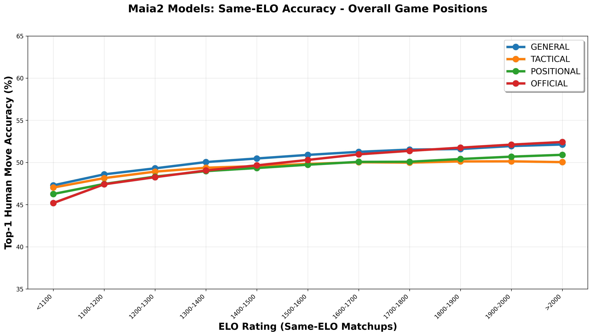
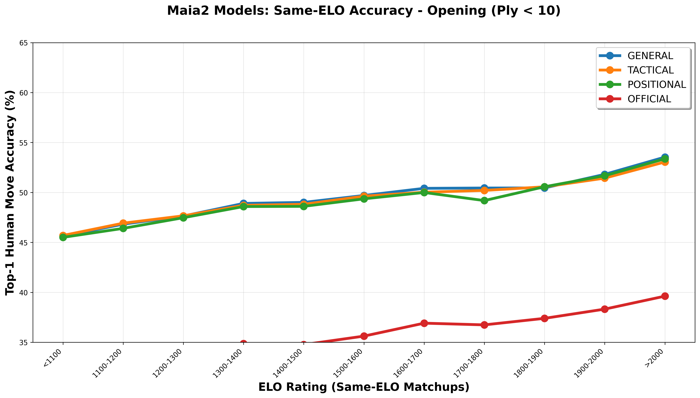
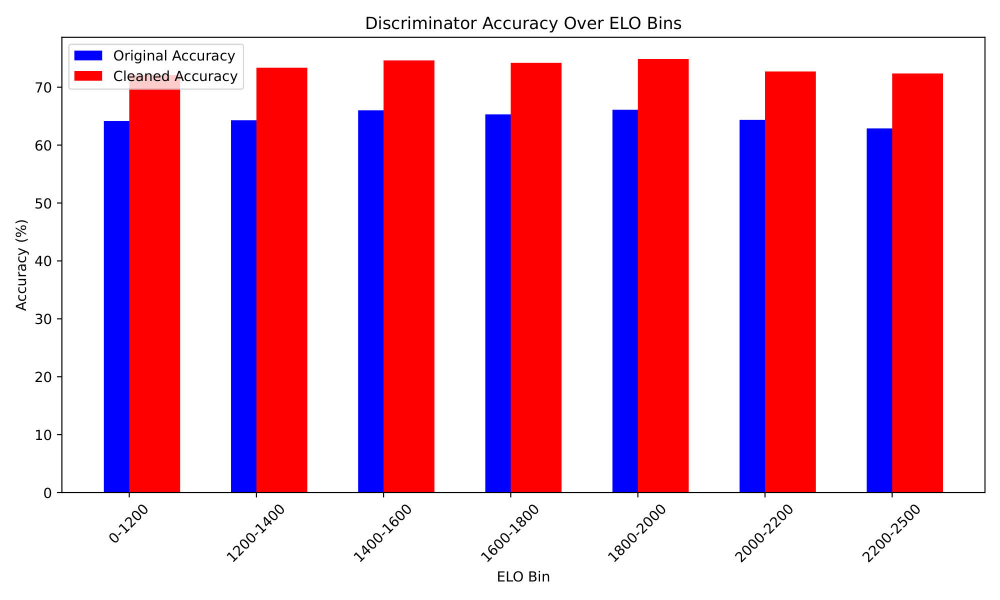
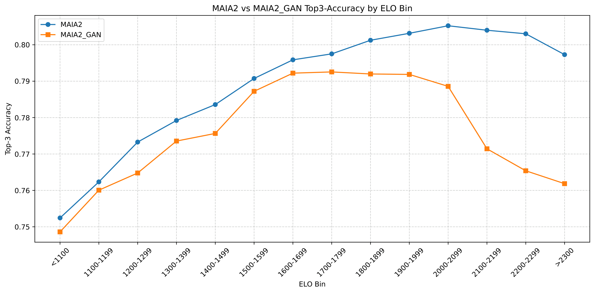

# Towards Human-Aligned Chess Engines <br>Replicating human player behavior across different skill levels

Bachelor’s thesis by **Andrei Todiraș**  
Institute for Artificial Intelligence, Department of Machine Learning for Simulation Sciences  
Supervisor: Andrei Manolache
Examiner: Prof. Dr. Mathias Niepert  
Commenced: 01.01.2026 · Completed: 31.03.2026

## Overview

This thesis explores how to make chess engines behave more like humans by aligning their predictions with different playing styles and skill levels. Starting from a state-of-the-art human-aligned engine **Maia2**, we investigate two methods not previously used in this way: **behavior stylometry** and **adversarial training**.

The goal of this thesis is not to build the strongest engine, but to build one that is more understandable, instructive, and psychologically plausible for human players.

[Read the full thesis](Thesis_Todiras.pdf)
## Methods & Results

### 1. Behavior Stylometry

Behavior stylometry was used to classify games into two broad style categories: **Tactical** and **Positional**.
The classification was based on 10 hand-crafted, efficiently computable features such as number of captures and checks, blunder rate, low-time fraction, game length etc.  
The datasets were then filtered using K-Means Clustering to train separate models for different styles, while keeping a mixed baseline model for comparison.
The general model outperforms official Maia2 at almost all levels of play, whilst all our models reach significantly higher accuracy in the opening.



### 2. Adversarial Training
The second method uses a WGAN-style setup:

- **Generator:** Maia2: $\mathcal{L}_G = \mathcal{L}_{original} - \lambda  \cdot \mathbb{E}_{(board, G\_move) \sim P_g} [D(board, G\_move)]$
- **Discriminator:** a network similar to Maia2, trained to distinguish human moves from engine-generated moves: $\mathcal{L}_D = - \mathbb{E}_{(board, human\_move) \sim P_{data}} [D(board, human\_move)] + \mathbb{E}_{(board, G\_move) \sim P_g} [D(board, G\_move)]$

To make training differentiable, we use the **Gumbel-Softmax trick**. The discriminator is trained with a Wasserstein-style objective, and its output is added as an adversarial loss term to the generator’s training objective. Findings include the need to pre-train the discriminator with a thoroughly cleaned dataset, leading to slightly better performance at lower ELO-levels.



## Tools and Stack

The thesis implementation builds on the Maia2 codebase and uses the following tools and concepts:

- **Maia2** (Deep CNN)
- **K-Means clustering**
- **PCA** for visualization
- **Wasserstein GAN (WGAN)** ideas
- **Gumbel-Softmax**
- **PyTorch** as main implementation tool
- **Linux Bash** for the training on GPU cluster

## Repository Contents

```text
.
├── README.md
├── Thesis_Todiras.pdf - the thesis itself
├── Abstract.txt and Kurzfassung.txt - the abstract in both English and German
├── Presentation.pptx - summary of the thesis in presentation form 
├── Literature/
    └── related work
└── Thesis_Latex/
    └── the full Latex project (includes all pictures and tables in the thesis)
├── Cluster/
    └── full codebase for all the results, instructions included in Instructions.md
